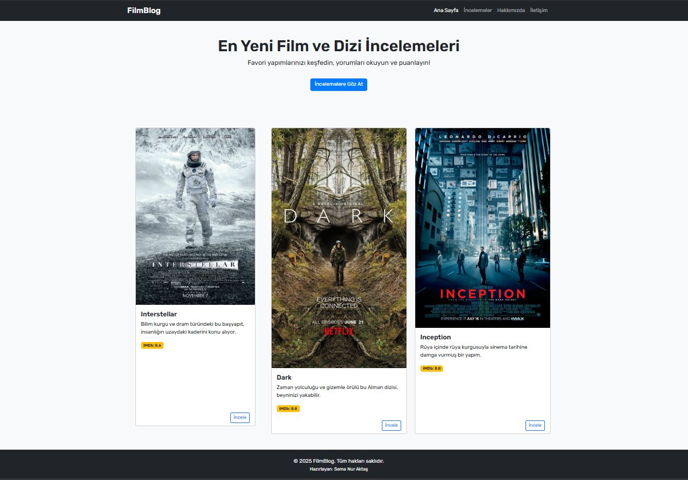
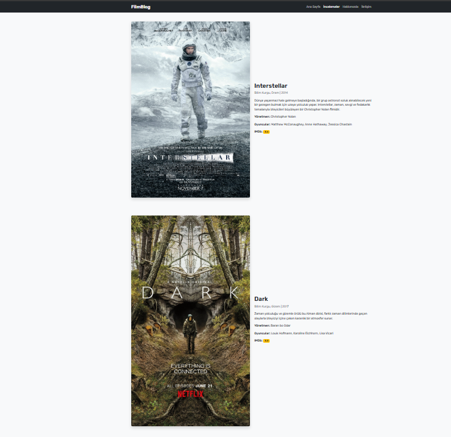
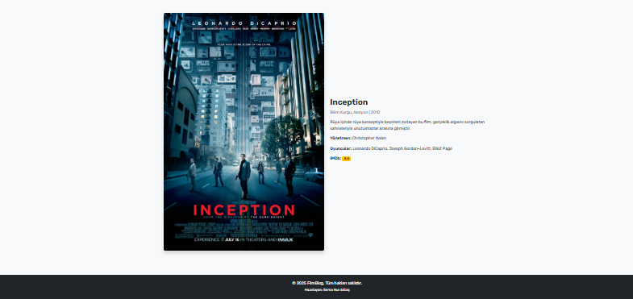
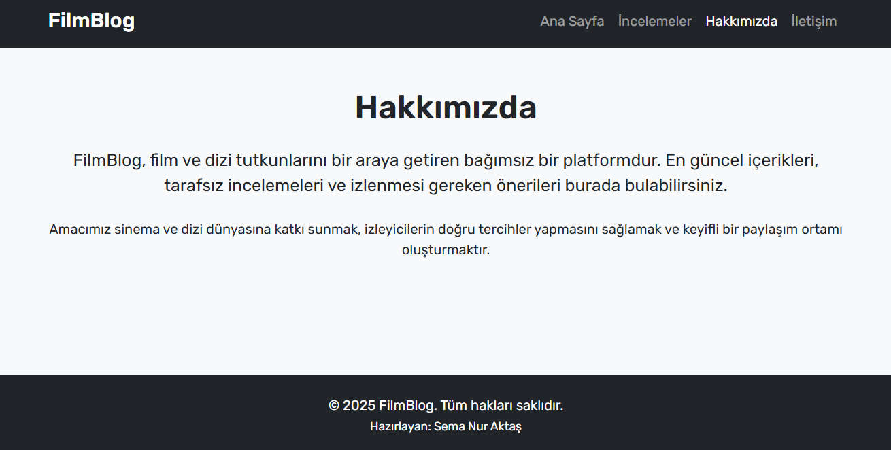
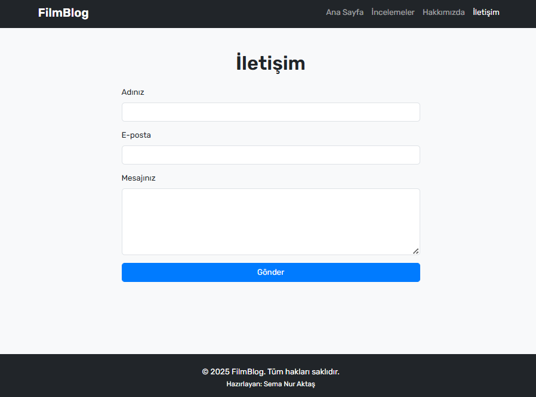

# 🎬 FilmBlog - HTML, CSS ve Bootstrap ile Hazırlanmış İnceleme Sitesi

**FilmBlog**, güncel film ve dizi içeriklerini tanıtmak amacıyla hazırlanmış basit ve şık bir web sitesidir. Bu proje HTML, CSS ve Bootstrap 5 kullanılarak oluşturulmuştur. Kullanıcılar ana sayfada önerilen yapımları görebilir, detay sayfasında incelemelere ulaşabilir ve site hakkında bilgi edinebilir veya iletişime geçebilir.

## 🔍 Canlı Önizleme

🌐 [FilmBlog'u Tarayıcınızda Görüntüle](https://semanurakts.github.io/Film-Dizi-Inceleme-Sitesi/index.html)

## 📷 Proje Görselleri

Ana sayfada ve inceleme sayfalarında aşağıdaki filmlere ait görseller kullanılmıştır:

- 
- 
- 
- 
- 

## 📄 Sayfalar

- `index.html` - Ana sayfa, öne çıkan film ve dizilerle birlikte "İncele" bağlantıları.
- `detail.html` - Interstellar, Dark ve Inception yapımları hakkında detaylı bilgiler.
- `about.html` - FilmBlog projesi ve amacı hakkında açıklamalar.
- `contact.html` - İletişim formu (örnek HTML form yapısı, gönderim işlevi yoktur).

## 💡 Kullanılan Teknolojiler

- **HTML5**
- **CSS3**
- **Bootstrap 5.3.7** (CDN üzerinden)
- **Google Fonts** - Rubik yazı tipi
- **Font Awesome** - İkon desteği

## 🧩 Stil Dosyaları

- `css/global.css` – Temel stil tanımlamaları ve yapılandırma.
- `css/main.css` – Sayfa öğelerine özel (navbar, footer, kartlar vb.) stiller.
- `css/tablet.css` – 768px altı tablet cihazlar için responsive ayarlamalar.
- `css/mobile.css` – 480px altı mobil cihazlar için özelleştirilmiş görünümler.

## 📱 Responsive Tasarım

Navbar ve içerikler tamamen responsive olacak şekilde tasarlanmıştır. Küçük ekranlarda menü, hamburger ikonu (üç çizgili) olarak görüntülenir ve tıklanarak açılır.

## 🔧 Kurulum ve Kullanım

1. Bu projeyi yerel bilgisayarına klonla veya indir:
   ```bash
   
   git clone https://github.com/semanurakts/Film-Dizi-Inceleme-Sitesi.git

## 🔓 Lisans

Bu proje kişisel ve eğitim amaçlı kullanımlar için tamamen ücretsizdir. Ticari projelerinizde kullanmadan önce ikon lisanslarını kontrol edin.

## 👩‍💻 Geliştirici

**SemaNur Aktaş** 
[Github](https://github.com/semanurakts) | [LinkedIn](https://www.linkedin.com/in/semanuraktas/)